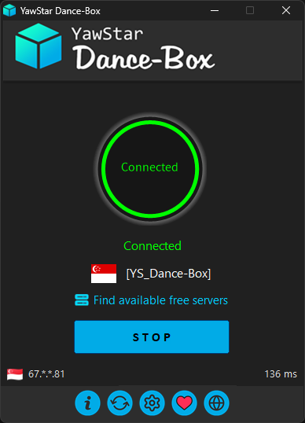
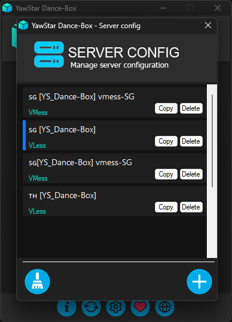
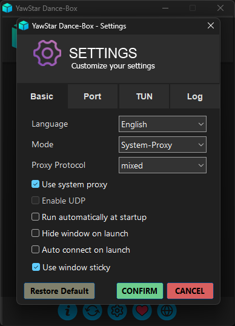

# 📦 YawStar Dance-Box v1.0.0.11

**YawStar Dance-Box** သည် မြန်မာနိုင်ငံမှ အင်တာနက်အသုံးပြုသူများအတွက် အထူးရည်ရွယ်၍ ဖန်တီးထားသော၊ အသုံးပြုရလွယ်ကူပြီး အစွမ်းထက်သည့် **Free VPN Client** တစ်ခုဖြစ်ပါသည်။

Windows OS (x64) ပေါ်တွင် အခြေခံထားပြီး ခေတ်မီ Network Protocols များဖြစ်သော VMess, VLess, Trojan, ShadowSock တို့​ကို အသုံးပြုကာ အင်တာနက်လွတ်လပ်ခွင့်နှင့် လုံခြုံရေးကို အကောင်းဆုံး ထောက်ပံ့ပေးထားပါသည်။

---

## ✨ Key Features

* **Multi-Protocol Support:** VMess, VLESS, Trojan, နှင့် Shadowsocks တို့ကို အပြည့်အဝထောက်ပံ့သည်။
* **One-Click Connectivity:** ရိုးရှင်းသော Interface ဖြင့် ခလုတ်တစ်ချက်နှိပ်ရုံဖြင့် ချိတ်ဆက်နိုင်သည်။
* **Optimized for Myanmar:** မြန်မာနိုင်ငံမှ အသုံးပြုသူများအတွက် အထူးကောင်းမွန်အောင် ပြုပြင်ထားသော Free Server List များ ပါဝင်သည်။
* **System Proxy & TUN Mode:** Windows OS တစ်ခုလုံးအတွက်ဖြစ်စေ၊ သတ်မှတ်ထားသော Application များအတွက်ဖြစ်စေ စိတ်ကြိုက် Proxy Mode ပြောင်းလဲအသုံးပြုနိုင်သည်။
* **Portable & Lightweight:** အခြား Library များစွာ မလိုအပ်ဘဲ ပေါ့ပါးစွာ အလုပ်လုပ်နိုင်သည်။

---

## 📸 Screenshots

| Connection Main | Free Server Selection | Server Configuration | Settings |
| :---: | :---: | :---: | :---: |
|  |  |  |

---

## 🚀 Installation & Usage

1. [Releases Page](https://github.com/YawStar/Dance-Box/releases) သို့မဟုတ် [Official Website](https://yawstardancebox.github.io/) မှ နောက်ဆုံးထွက် Version ကို ဒေါင်းလုဒ်ရယူပါ။
2. ရရှိလာသော `YawStar Dance-Box_v1.0.**_x64_Setup.exe` ကို Run ပါ။
3. **Find available free servers** ကိုနှိပ်၍ မိမိနှစ်သက်ရာ Server ကို ရွေးချယ်ပါ။
4. **START** ကိုနှိပ်၍ လုံခြုံစွာ အသုံးပြုနိုင်ပါပြီ။

---

## 🛠 Built With

* **Language:** Kotlin, Java, Go
* **Core:** sing-box
* **Architecture:** Windows x64, ARM64(Comming Soon)
* **Platform:** Windows, Android(Comming Soon)

---

## 📧 Support & Contact

အသုံးပြုရင်း အခက်အခဲရှိပါက သို့မဟုတ် အကြံပြုလိုပါက အောက်ပါ လိပ်စာများမှတစ်ဆင့် ဆက်သွယ်နိုင်ပါသည်။

* **Official Website:** [yawstardancebox.github.io](https://yawstardancebox.github.io/)
* **Email:** `yawstar.2009@gmail.com`
* **Developer:** YawHackka

---

> **Note:** YawStar Dance-Box သည် မြန်မာပြည်သူများအတွက် အခမဲ့ VPN တစ်ခုအဖြစ် `YawStar` မှ ဖန်တီးထားခြင်းဖြစ်ပါသည်။
